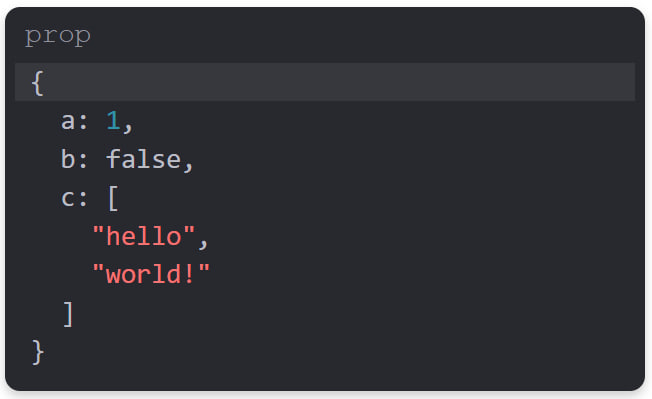

# Tweakpane JSON extention
Plugin template of an input binding for [Tweakpane][tweakpane].



## Usage


### Browser
```html
<script type="module">
  import {Pane} as Tweakpane from 'tweakpane';
  import * as JsonPlugin from 'tweakpane-json-plugin';

  const pane = new Pane();
  pane.registerPlugin(JsonPlugin);
</script>
```


### Package
```js
import {Pane} from 'tweakpane';
import * as JsonPlugin from 'tweakpane-json-plugin';

const pane = new Pane();
pane.registerPlugin(JsonPlugin);
```


## Usage
```js
const params = {
  prop: {
    a: 1,
    b: false, 
    c: ["hello", "world!"]
  }
};

// TODO: Update parameters for your plugin
pane.addInput(params, 'prop', {
  view: 'json',
}).on('change', (ev) => {
  console.log(ev.value);
});
```


[tweakpane]: https://github.com/cocopon/tweakpane/
